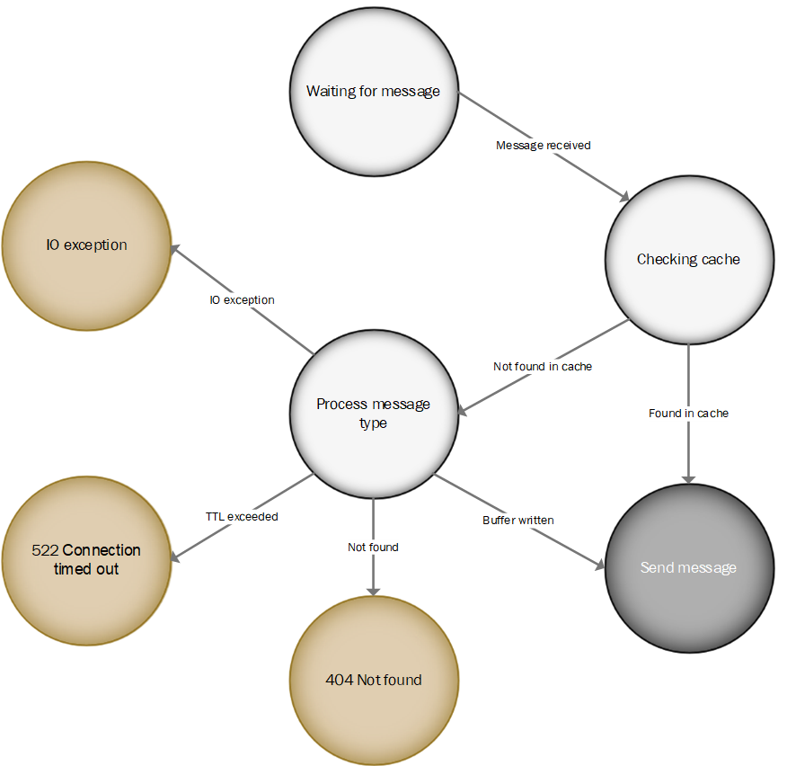
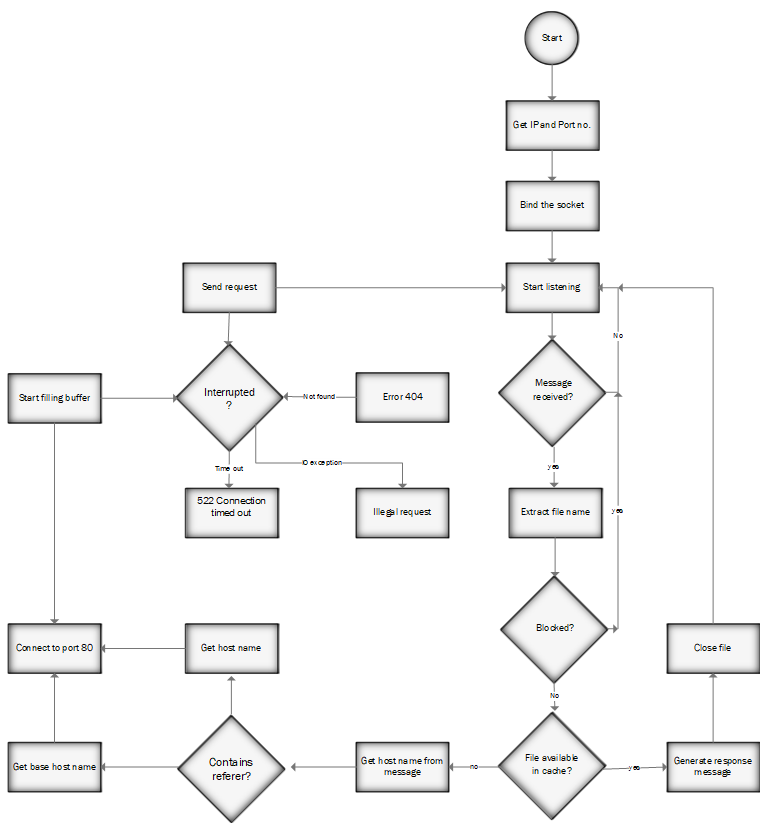

# Proxy Server Implementation

## Table of Contents

- [Introduction](#introduction)
- [Design](#design)
  - [Steps](#steps)
  - [Flowchart](#flowchart)
  - [Finite State Machine](#finite-state-machine)
- [Implementation](#implementation)
- [Test Cases](#test-cases)
- [Links and References](#links-and-references)
- [Contributors](#contributors)
- [Acknowledgements](#acknowledgements)
- [License](#license)

## Introduction

An endpoint device, such as a computer, and another server from which a user or client is seeking a service are connected through a proxy server, which is a specialized computer or software system operating on a computer. The proxy server transmits requests through the firewall and might run on the same machine as the firewall server or on a different server. A proxy server's cache can be used to serve all users, which is a benefit. The user response time will be faster if a proxy has cached one or more Internet sites that are often queried. Additionally, a proxy can record its communications, which is useful for debugging.

A proxy server checks its local cache of previously visited sites when it receives a request for an Internet resource (such as a Web page). Without having to send the request to the Internet, it returns the page to the user if it is found. If the page is not in the cache, the proxy server requests it from the server on the Internet using one of its own IP addresses while serving as the user's client. The proxy server links the page that is returned to the initial request and sends it on to the user.

There are both legitimate and illegitimate uses for proxy servers. A proxy server is used in the workplace to improve security, administrative control, and caching services. Proxy servers are used in personal computing to support user privacy and anonymous browsing. Users can set up their web browsers to constantly use a proxy server or access web proxies online. For HTTP, SSL, FTP, and SOCKS proxies, browser settings provide both automatically recognized and manually selectable options. Proxy servers can accommodate numerous users or simply one at a time. Shared and dedicated proxies are the names of these choices.

An example of using proxy servers in an illegitimate way is a bug found in WhatsApp on January 3, 2023. Governments all across the world occasionally impose restrictions on WhatsApp and other social media platforms. To combat this, WhatsApp is releasing a new feature that lets you bypass the service limitations in your country. Volunteers and organizations can set up proxy servers if your government decides to block access to WhatsApp. People can use these servers to reconnect to WhatsApp and resume communication with their friends and family. You may set up a proxy using a server accessible on ports 80, 443, or 5222 and a domain name (or subdomain) that corresponds to the IP address of the server.

## Design

### Steps

1. Initialize IP and port number (using port 5078).
2. Start the proxy server by binding the IP and port number.
3. Start listening for messages until a message is received.
4. Extract the filename and check if the host site is in the blocked list (`blockedfiles.txt`). If blocked, drop the message.
5. Check if the file is in the cache. If cached, return the cached data. If not cached, create a cache file and handle the request.

### Finite State Machine

### Flowchart

### Links and References
Github Repo: Proxy Server GitHub
References:
-  C. L. Jeffery, S. R. Das, and G. S. Bernal, "Proxy-sharing proxy servers," Proceedings of COM'96. First Annual Conference on Emerging Technologies and Applications in Communications, 1996, pp. 116-119, doi: 10.1109/ETACOM.1996.502490.
-  W. V. Wathsala, B. Siddhisena, and A. S. Athukorale, "Next Generation Proxy Servers," 2008 10th International Conference on Advanced Communication Technology, 2008, pp. 2183-2187, doi: 10.1109/ICACT.2008.4494223.
-  [Fortinet Cyber Glossary - Proxy Server](https://www.fortinet.com/resources/cyberglossary/proxy-server)
-  [Forbes Article on Bypassing WhatsApp Ban](https://www.forbes.com/sites/prakharkhanna/2023/01/06/you-can-now-bypass-whatsapp-ban-by-using-a-proxy/?sh=9dcfc9f6c421)
